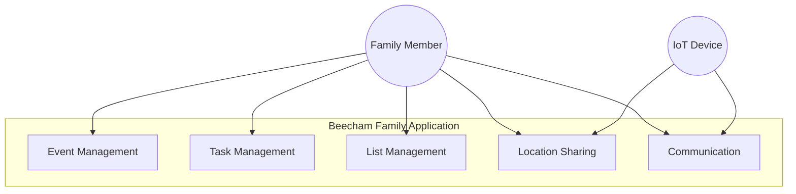
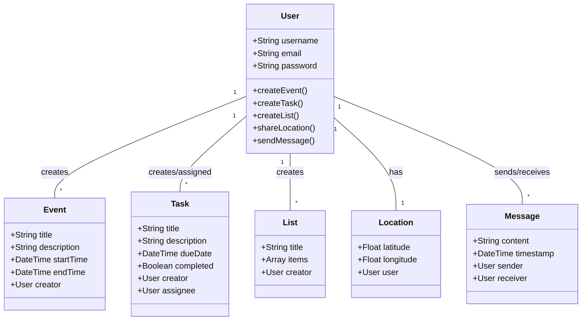
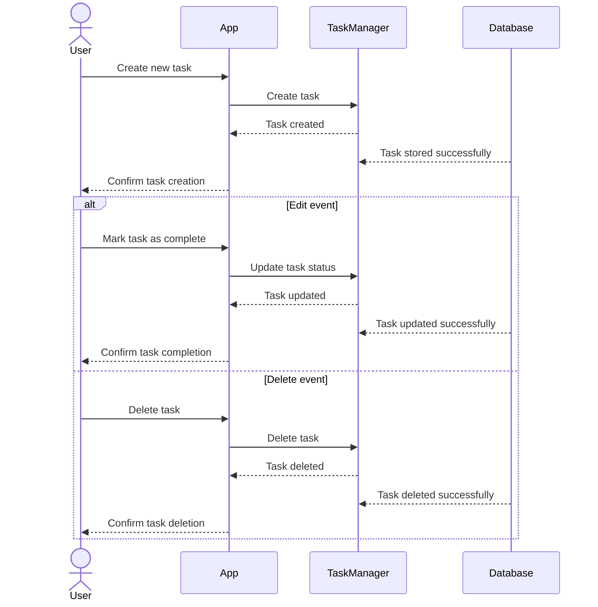
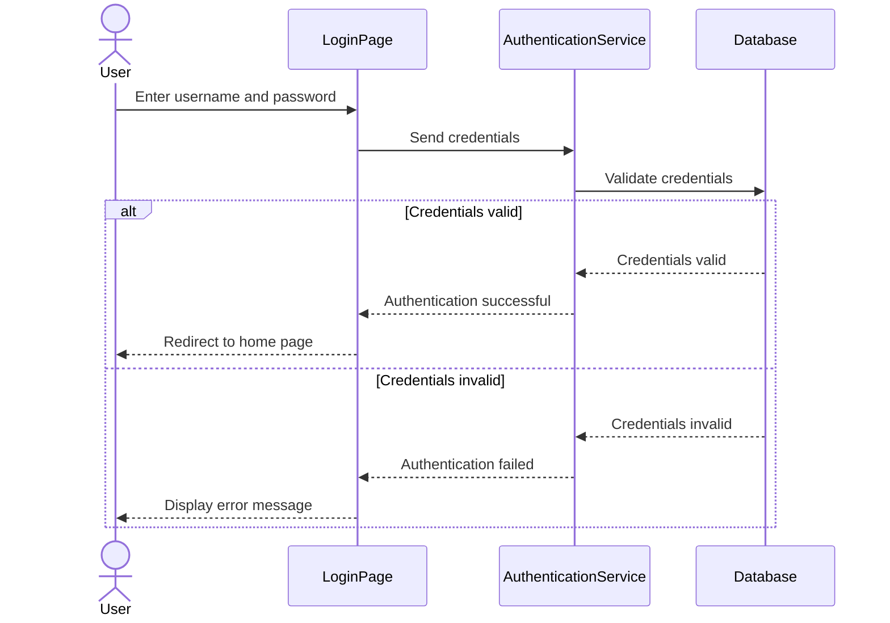
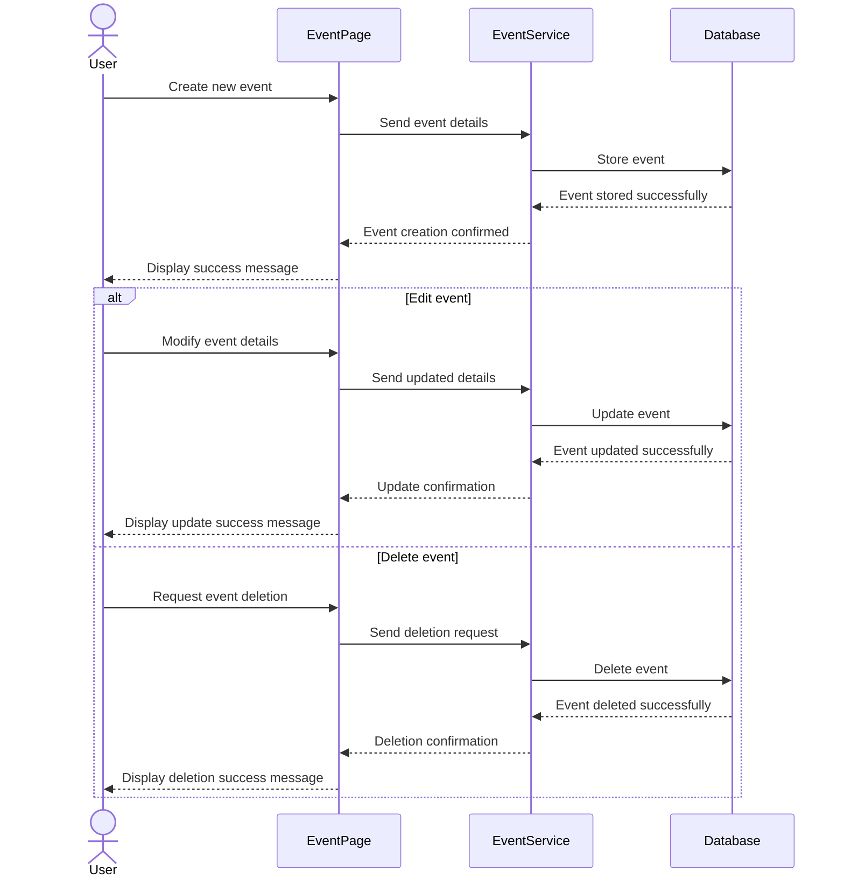

# Diagrams

1. Use Case Diagram

```mermaid
graph TD
    User((Family Member))
    IoT((IoT Device))
    
    subgraph Beecham Family Application
    A[Event Management]
    B[Task Management]
    C[List Management]
    D[Location Sharing]
    E[Communication]
    end
    
    User --> A
    User --> B
    User --> C
    User --> D
    User --> E
    IoT --> D
    IoT --> E
```

2. Class Diagram

```mermaid
classDiagram
    class User {
        +String username
        +String email
        +String password
        +createEvent()
        +createTask()
        +createList()
        +shareLocation()
        +sendMessage()
    }
    class Event {
        +String title
        +String description
        +DateTime startTime
        +DateTime endTime
        +User creator
    }
    class Task {
        +String title
        +String description
        +DateTime dueDate
        +Boolean completed
        +User creator
        +User assignee
    }
    class List {
        +String title
        +Array<String> items
        +User creator
    }
    class Location {
        +Float latitude
        +Float longitude
        +User user
    }
    class Message {
        +String content
        +DateTime timestamp
        +User sender
        +User receiver
    }

    User "1" -- "*" Event : creates
    User "1" -- "*" Task : creates/assigned
    User "1" -- "*" List : creates
    User "1" -- "1" Location : has
    User "1" -- "*" Message : sends/receives
```

3. Sequence Diagram for Task Management

```mermaid
sequenceDiagram
    actor User
    participant App
    participant TaskManager
    participant Database

    User->>App: Create new task
    App->>TaskManager: Create task
    TaskManager-->>App: Task created
    Database-->>TaskManager: Task stored successfully
    App-->>User: Confirm task creation
    
    alt Edit event
        User->>App: Mark task as complete
        App->>TaskManager: Update task status
        TaskManager-->>App: Task updated
        Database-->>TaskManager: Task updated successfully
        App-->>User: Confirm task completion
    else Delete event
        User->>App: Delete task
        App->>TaskManager: Delete task
        TaskManager-->>App: Task deleted
        Database-->>TaskManager: Task deleted successfully
        App-->>User: Confirm task deletion
    end
```

4. User Authentication Sequence Diagram:

```mermaid
sequenceDiagram
    actor User
    participant LoginPage
    participant AuthenticationService
    participant Database

    User->>LoginPage: Enter username and password
    LoginPage->>AuthenticationService: Send credentials
    AuthenticationService->>Database: Validate credentials
    alt Credentials valid
        Database-->>AuthenticationService: Credentials valid
        AuthenticationService-->>LoginPage: Authentication successful
        LoginPage-->>User: Redirect to home page
    else Credentials invalid
        Database-->>AuthenticationService: Credentials invalid
        AuthenticationService-->>LoginPage: Authentication failed
        LoginPage-->>User: Display error message
    end
```

5. Event Management Sequence Diagram:

```mermaid
sequenceDiagram
    actor User
    participant EventPage
    participant EventService
    participant Database

    User->>EventPage: Create new event
    EventPage->>EventService: Send event details
    EventService->>Database: Store event
    Database-->>EventService: Event stored successfully
    EventService-->>EventPage: Event creation confirmed
    EventPage-->>User: Display success message

    alt Edit event
        User->>EventPage: Modify event details
        EventPage->>EventService: Send updated details
        EventService->>Database: Update event
        Database-->>EventService: Event updated successfully
        EventService-->>EventPage: Update confirmation
        EventPage-->>User: Display update success message
    else Delete event
        User->>EventPage: Request event deletion
        EventPage->>EventService: Send deletion request
        EventService->>Database: Delete event
        Database-->>EventService: Event deleted successfully
        EventService-->>EventPage: Deletion confirmation
        EventPage-->>User: Display deletion success message
    end
```